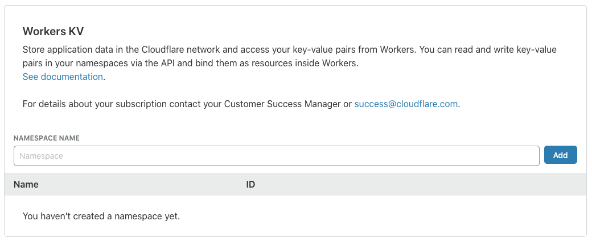

# kv-orm-cf-workers

A [Cloudflare Workers KV](https://www.cloudflare.com/products/workers-kv/) datastore plugin for [kv-orm].

> Note: Requires the latest Namespace version.

[](https://www.npmjs.com/package/kv-orm-cf-workers)
[](https://www.npmjs.com/package/kv-orm-cf-workers)
[](https://www.npmjs.com/package/kv-orm-cf-workers)
[](https://www.npmjs.com/package/kv-orm-cf-workers)
[](./LICENSE)
[](https://www.typescriptlang.org/)

## Installation

`npm install --save kv-orm kv-orm-cf-workers`

## Setup

1. Create a Namespace in Cloudflare, by either:
   - Using the UI:
     1. In the [Cloudflare Dashboard](https://dash.cloudflare.com/), navigate to the Workers tab:
        
     1. Under the **Workers KV** section, enter a name, and click `Add`:
        
   - [Using the API](https://workers.cloudflare.com/docs/reference/storage/api/#create-a-namespace)
   - Using a deploy tool:
     - [Serverless](https://github.com/cloudflare/serverless-cloudflare-workers#using-cloudflare-kv-storage)
     - Wrangler ([Coming Soon](https://github.com/cloudflare/wrangler/issues/339)!)
1. Bind the Namespace to a variable in your script:
   - Using the UI:
     1. Navigate to the Worker Editor:
        
     1. Select your Script, and go the the Resources tab.
     1. Click `+ Add Binding`, select your new Namespace, and click `Save`:
        
   - Using the API
   - Using a deploy tool:
     - [Serverless](https://github.com/cloudflare/serverless-cloudflare-workers#using-cloudflare-kv-storage)
1. This makes the binded, global variable [available within the Cloudflare Worker Script](https://workers.cloudflare.com/docs/reference/storage/api/#worker-api).

> Note: It's recommended that you use an exclusive namespace for a kv-orm datastore
> i.e. don't manually store any data in that Namespace, at risk of having it overwritten by kv-orm.

## Usage

```typescript
import { BaseEntity, Column, Entity } from "kv-orm";
import { CloudflareWorkersKVDatastore } from "kv-orm-cf-workers";

// Bind a Cloudflare Namespace to a variable (see Setup above): e.g. LIBRARY

const cfWorkersKVDatastore = new CloudflareWorkersKVDatastore(LIBRARY);

@Entity(cfWorkersKVDatastore)
class Author extends BaseEntity {
  @Column()
  public firstName!: string;

  @Column()
  public lastName!: string;
}

// For more information how to then use Author, check out the kv-orm package:
// https://github.com/GregBrimble/kv-orm
```

## Limitations

- [ ] Investigating Relationships  
       _~~_-to-many Relationships are limited to 4000 instances. It may be possible to overcome this limitation by having tree-like 'spaces' to contain multiple sets of children (untested!).~~

[kv-orm]: https://github.com/GregBrimble/kv-orm
